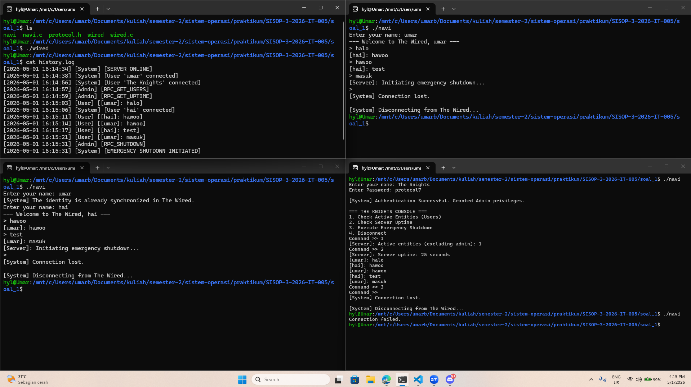

# SISOP-3-2026-IT-005

|              |            |
| ------------ | ---------- |
| Nama         | Umar       |
| NRP          | 5027251005 |
| Kode Asisten | KENZ       |

# Struktur Repositori:

```SISOP-3-2026-IT-005/
├── soal_1/
│   ├── protocol.h
│   ├── wired.c
│   └── navi.c
├── soal_2/
│   ├── arena.h
│   ├── orion.c
│   ├── eternal.c
│   └── Makefile
├── assets/
└── README.md
```

# Reporting

## Soal 1 - Present Day, Present Time

#### Penjelasan Umum

Soal 1 adalah aplikasi chat TCP dengan dua program:

1. `wired.c` sebagai server.
2. `navi.c` sebagai client.
3. `protocol.h` sebagai format paket data yang dipertukarkan.

Alurnya:

1. Client connect ke server di `127.0.0.1:8080`.
2. User login sebagai user biasa atau admin (`The Knights`).
3. Server memproses command berbasis `cmd` pada `DataPacket`.
4. User biasa dapat chat broadcast, admin dapat RPC monitoring dan shutdown.

---

#### Detail Kode `protocol.h`

File ini tidak punya function, tapi mendefinisikan protokol yang dipakai semua function di server-client.

##### Enum command (`CommandType`)

```c
typedef enum {
    CMD_LOGIN, CMD_LOGIN_ADMIN, CMD_SUCCESS, CMD_FAILED, CMD_MSG, CMD_QUIT,
    CMD_REQ_USERS, CMD_REQ_UPTIME, CMD_HALT, CMD_INFO
} CommandType;
```

Kasarannya, enum ini mendefinisikan semua jenis command yang bisa dikirim client ke server (`CMD_LOGIN`, `CMD_MSG`, dll) dan juga response dari server ke client (`CMD_SUCCESS`, `CMD_INFO`, dll).

##### Struktur paket (`DataPacket`)

```c
typedef struct {
    CommandType cmd;
    char username[50];
    char text[BUF_SIZE];
} DataPacket;
```

Semua komunikasi antara server dan client memakai struktur `DataPacket`, yang berisi:
- `cmd`: jenis command atau response.
- `username`: nama user yang terlibat (bisa kosong untuk beberapa command).
- `text`: pesan chat atau info server.

---

#### Detail Kode `wired.c` (Server)

##### `write_log(const char* actor, const char* info)`

```c
FILE *file = fopen("history.log", "a");
strftime(ts, sizeof(ts), "%Y-%m-%d %H:%M:%S", t);
fprintf(file, "[%s] [%s] [%s]\n", ts, actor, info);
```

Function ini append log ke `history.log`, lalu menyimpan timestamp + aktor + info event.

##### `send_to_all(DataPacket *paket, int sender_socket)`

```c
if (user_list[i].socket_fd != 0 &&
    user_list[i].socket_fd != sender_socket &&
    user_list[i].is_logged_in) {
    send(user_list[i].socket_fd, paket, sizeof(DataPacket), 0);
}
```

Function ini mengirim paket ke semua user yang sedang login, tapi mengecualikan socket pengirim. Jadi, jika user A mengirim pesan, user B dan C akan menerima pesan itu, tapi A tidak akan menerima pesan yang dia kirim sendiri.

##### `check_duplicate_name(const char* name)`

```c
if (user_list[i].is_logged_in && strcmp(user_list[i].uname, name) == 0) {
    return 1;
}
```

Mencegah 2 user aktif memakai nama yang sama di saat bersamaan.

##### `main()`

Function `main()` di server memegang seluruh event loop.

###### Bagian inisialisasi socket server

```c
server_fd = socket(AF_INET, SOCK_STREAM, 0);
setsockopt(server_fd, SOL_SOCKET, SO_REUSEADDR, &opt, sizeof(opt));
bind(server_fd, (struct sockaddr *)&address, sizeof(address));
listen(server_fd, 10);
```

Ini adalah setup TCP server standar: buat socket, set opsi reuse address, bind ke port, lalu listen untuk koneksi masuk.

###### Bagian loop multiplexer `select()`

```c
read_fds = fd_pool;
if (select(fd_max + 1, &read_fds, NULL, NULL, NULL) < 0) continue;
```

Hanya ada satu thread/process server, tapi dengan `select()` server bisa memantau banyak socket (client) sekaligus. `select()` akan memberitahu server ketika ada aktivitas di salah satu socket, sehingga server bisa merespon tanpa harus blocking pada satu koneksi saja.

###### Handle koneksi baru

```c
if (i == server_fd) {
    client_fd = accept(server_fd, NULL, NULL);
    FD_SET(client_fd, &fd_pool);
}
```

Jika `select()` menunjukkan ada aktivitas di `server_fd`, berarti ada client baru yang mencoba connect. Server menerima koneksi itu dengan `accept()`, lalu menambahkan socket client ke `fd_pool` agar bisa dipantau di iterasi berikutnya.

###### Handle disconnect / quit

```c
if (recv_size <= 0 || paket.cmd == CMD_QUIT) {
    close(i);
    FD_CLR(i, &fd_pool);
    user_list[idx].socket_fd = 0;
    user_list[idx].is_logged_in = 0;
}
```

Ketika `recv()` mengembalikan 0 atau negatif, artinya client sudah disconnect. Atau jika client mengirim command `CMD_QUIT`, server juga akan memprosesnya sebagai permintaan keluar. Dalam kedua kasus, server menutup socket, menghapusnya dari `fd_pool`, dan membersihkan state user terkait.

###### Handle login user/admin

```c
case CMD_LOGIN:
case CMD_LOGIN_ADMIN:
    if (check_duplicate_name(paket.username)) {
        paket.cmd = CMD_FAILED;
    } else {
        user_list[idx].is_admin = (paket.cmd == CMD_LOGIN_ADMIN);
        paket.cmd = CMD_SUCCESS;
    }
```

Validasi nama unik terlebih dahulu. Jika nama sudah dipakai, server mengirim `CMD_FAILED`. Jika nama valid, server set flag admin jika commandnya `CMD_LOGIN_ADMIN`, lalu kirim `CMD_SUCCESS` ke client.

###### Handle chat

```c
case CMD_MSG:
    write_log("User", msg);
    send_to_all(&paket, i);
```

Pesan chat yang dikirim user akan disimpan ke log dengan tag "User", lalu dikirim ke semua user lain yang sedang login.

###### RPC admin: user count

```c
case CMD_REQ_USERS:
    if (user_list[idx].is_admin) {
        sprintf(rep.text, "Active entities (excluding admin): %d", total);
        send(i, &rep, sizeof(DataPacket), 0);
    }
```

Jika command `CMD_REQ_USERS` diterima, server cek apakah pengirim adalah admin. Jika iya, server hitung jumlah user aktif (kecuali admin) dan kirimkan info itu kembali ke admin.

###### RPC admin: uptime

```c
case CMD_REQ_UPTIME:
    sprintf(rep.text, "Server uptime: %ld seconds", time(NULL) - time_started);
```

Jika command `CMD_REQ_UPTIME` diterima, server hitung uptime dengan selisih waktu sekarang dan waktu saat server startup, lalu kirimkan info itu ke admin.

###### RPC admin: halt

```c
case CMD_HALT:
    send_to_all(&rep, i);
    exit(0);
```

Admin bisa memicu emergency shutdown setelah broadcast info ke user lain.

---

#### Detail Kode `navi.c` (Client)

##### `handle_signal(int sig)`

```c
void handle_signal(int sig) {
    is_running = 0;
}
```

Saat client menerima sinyal `SIGINT` (misal dari `Ctrl+C`), flag `is_running` diset ke 0, yang akan menghentikan loop utama client secara terkontrol. Ini memungkinkan client untuk melakukan cleanup atau mengirim command keluar ke server sebelum benar-benar berhenti.

##### `main()`

Function `main()` menangani connect, login, dan loop interaksi.

###### Koneksi ke server

```c
client_socket = socket(AF_INET, SOCK_STREAM, 0);
serv_addr.sin_addr.s_addr = inet_addr("127.0.0.1");
serv_addr.sin_port = htons(SERVER_PORT);
connect(client_socket, (struct sockaddr *)&serv_addr, sizeof(serv_addr));
```

Client selalu connect ke localhost port yang sama dengan server.

###### Login user/admin

```c
if (strcmp(input_name, "The Knights") == 0) {
    if (strcmp(pwd, "protocol7") == 0) {
        paket.cmd = CMD_LOGIN_ADMIN;
    }
} else {
    paket.cmd = CMD_LOGIN;
}
```

Admin ditentukan oleh kombinasi username + password, selain itu dianggap user biasa.

###### Loop `select()` client

```c
FD_SET(STDIN_FILENO, &read_fds);
FD_SET(client_socket, &read_fds);
select(client_socket + 1, &read_fds, NULL, NULL, NULL);
```

Sama seperti server, client juga memakai `select()` untuk memantau input dari keyboard (`STDIN_FILENO`) dan pesan dari server (`client_socket`) secara bersamaan.

###### Terima pesan dari server

```c
if (paket.cmd == CMD_MSG) {
    printf("[%s]: %s\n", paket.username, paket.text);
} else if (paket.cmd == CMD_INFO) {
    printf("[Server]: %s\n", paket.text);
}
```

Ini membedakan antara pesan chat biasa (`CMD_MSG`) yang berasal dari user lain, dan pesan info (`CMD_INFO`) yang berasal dari server (misal hasil RPC admin). Pesan chat ditampilkan dengan format `[username]: message`, sedangkan info server ditampilkan dengan prefix `[Server]:`.


###### Input admin

```c
switch (menu) {
    case 1: paket.cmd = CMD_REQ_USERS; break;
    case 2: paket.cmd = CMD_REQ_UPTIME; break;
    case 3: paket.cmd = CMD_HALT; break;
    case 4: is_running = 0; continue;
}
```

Menu admin menawarkan 3 RPC (user count, uptime, halt) dan opsi keluar. Setelah memilih, client mengirim command yang sesuai ke server.

###### Input user biasa

```c
if (strcmp(buffer, "/exit") == 0) break;
paket.cmd = CMD_MSG;
strcpy(paket.text, buffer);
send(client_socket, &paket, sizeof(DataPacket), 0);
```

User biasa bisa mengirim pesan chat atau ketik `/exit` untuk keluar. Pesan chat dikemas dalam `DataPacket` dengan `cmd = CMD_MSG` dan dikirim ke server.

###### Penutupan koneksi

```c
paket.cmd = CMD_QUIT;
send(client_socket, &paket, sizeof(DataPacket), 0);
close(client_socket);
```

Saat client ingin keluar (misal dari menu admin atau user), client mengirim command `CMD_QUIT` ke server untuk memberitahu bahwa user ini akan disconnect, lalu menutup socket.

---

#### Output



---

## Soal 2 - The Eternal Battle