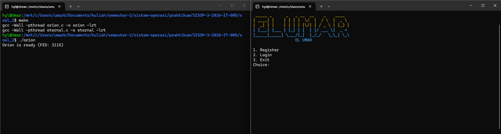
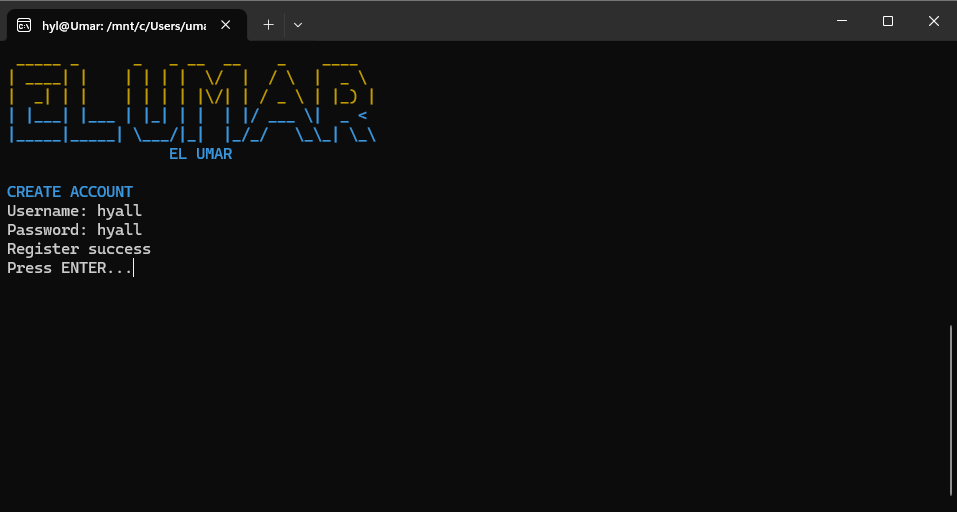
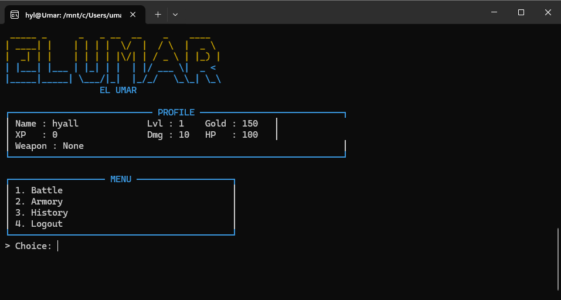
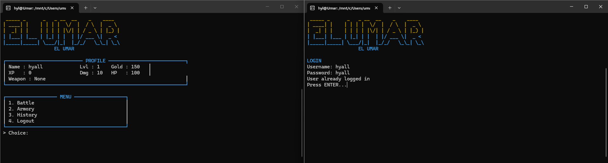
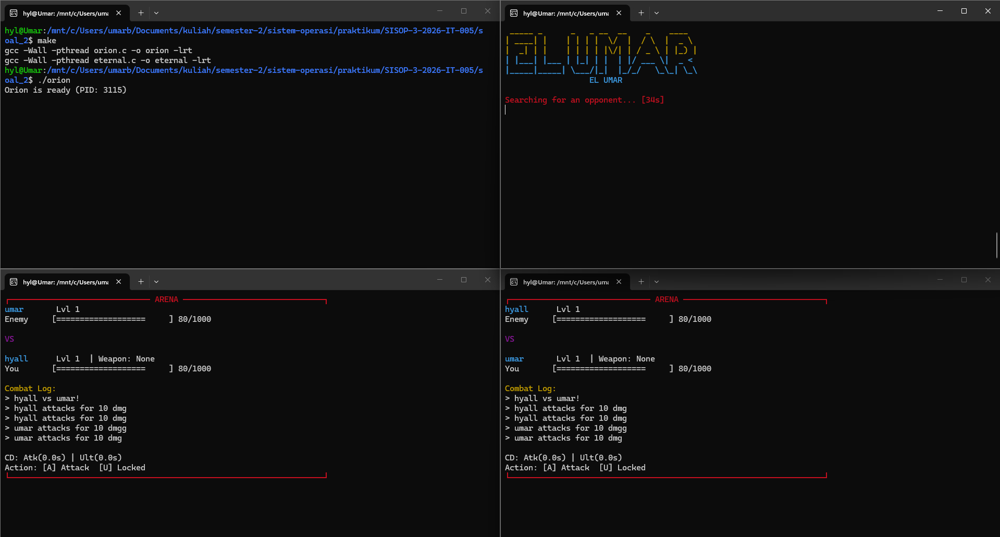
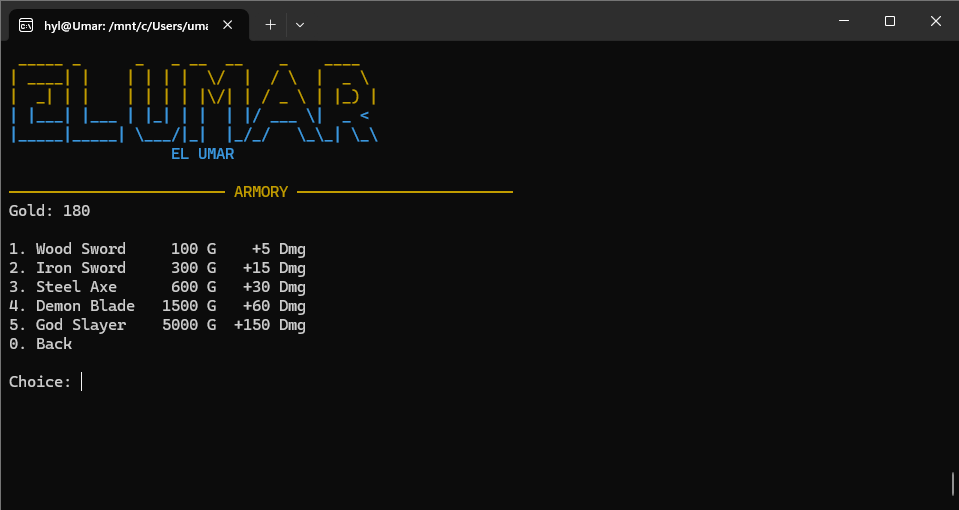
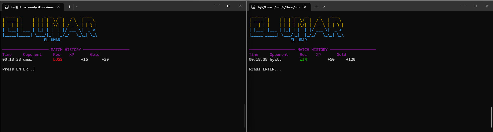

# SISOP-3-2026-IT-005

|              |            |
| ------------ | ---------- |
| Nama         | Umar       |
| NRP          | 5027251005 |
| Kode Asisten | KENZ       |

# Struktur Repositori:

```SISOP-3-2026-IT-005/
├── soal_1/
│   ├── protocol.h
│   ├── wired.c
│   └── navi.c
├── soal_2/
│   ├── arena.h
│   ├── orion.c
│   ├── eternal.c
│   └── Makefile
├── assets/
└── README.md
```

# Reporting

## Soal 1 - Present Day, Present Time

Pada soal nomor 1 diminta untuk membangun sebuah infrastruktur komunikasi jaringan tersentralisasi (client-server) menggunakan TCP/IP Socket. Server diberi nama The Wired (wired.c) dan aplikasinya bernama NAVI (navi.c). Program ini harus memiliki beberapa spesifikasi:

1. Membuat protokol komunikasi via port yang ditentukan.

2. NAVI dapat mengirim pesan dan mendengarkan pesan masuk secara asinkron tanpa menggunakan fork().

3. Server berskala tinggi yang mampu mendeteksi banyak klien sekaligus secara mulus (multiplexing).

4. Penanganan identitas unik, di mana klien dengan nama yang sama akan ditolak.

5. Mekanisme Broadcast yang dikendalikan oleh server.

6. Entitas khusus pengelola jaringan (The Knights) yang menggunakan otentikasi password untuk mengakses fitur RPC (Remote Procedure Call) seperti mengecek entitas aktif, uptime server, dan mematikan server.

7. Implementasi sistem Logging permanen di history.log dengan penanda waktu.

Berikut bagian-bagian penyelesaian mendetail untuk soal 1:

1. Protokol Komunikasi (`protocol.h`)

Penyatuan kerangka data antara client dan server dibungkus dalam struct `DataPacket`.

```c
typedef enum {
    CMD_LOGIN,
    CMD_LOGIN_ADMIN,
    CMD_SUCCESS,
    // ... commands lainnya ...
    CMD_INFO
} CommandType;

typedef struct {
    CommandType cmd;
    char username[50];
    char text[BUF_SIZE];
} DataPacket;
```

Setiap data yang melintasi socket TCP akan berukuran pasti (seukuran `DataPacket`) dan memiliki header instruksi (`CommandType`). Ini membuat komunikasi sangat terstruktur. Identifikasi jenis permintaan dikontrol oleh field `cmd` alih-alih me-parsing string manual.

2. Client (`navi.c`)

Sesuai permintaan spesifikasi, `navi` dapat mendengarkan server dan menunggu input keyboard user dalam satu waktu secara asinkron (tanpa fungsi `fork`). Hal ini diwujudkan dengan teknik I/O Multiplexing (`select`).

```c
    while (is_running) {
        FD_ZERO(&read_fds);
        FD_SET(STDIN_FILENO, &read_fds); // File descriptor input keyboard
        FD_SET(client_socket, &read_fds); // File descriptor socket server

        if (select(client_socket + 1, &read_fds, NULL, NULL, NULL) < 0) break; 

        if (FD_ISSET(client_socket, &read_fds)) {
            // Menerima transmisi dari The Wired (Server)
        }
        if (FD_ISSET(STDIN_FILENO, &read_fds)) {
            // Menerima input ketikan dari pengguna (Keyboard)
        }
    }
```

Logikanya program menggunakan makro `FD_SET` untuk mendaftarkan Standard Input (keyboard) dan soket server ke dalam satu himpunan (set). Fungsi `select()` akan memblokir (menahan) eksekusi sampai ada salah satu kanal yang mengirim data. Jika server mengirim pesan (seperti pesan obrolan orang lain), blok pertama dieksekusi. Jika user mengetik, blok kedua dieksekusi.

3. Server (`wired.c`)

Sama seperti client, server juga tidak mengandalkan multithreading atau multi-processing (`fork`), melainkan menggunakan `select()`.

```c
        read_fds = fd_pool;
        if (select(fd_max + 1, &read_fds, NULL, NULL, NULL) < 0) continue;

        for (int i = 0; i <= fd_max; i++) {
            if (!FD_ISSET(i, &read_fds)) continue;

            if (i == server_fd) {
                // Menangani koneksi NAVI baru
                client_fd = accept(server_fd, NULL, NULL);
                FD_SET(client_fd, &fd_pool);
                // ... simpan ke user_list
            } else {
                // Menangani pesan, perintah, atau diskoneksi dari NAVI yang sudah ada
                int recv_size = recv(i, &paket, sizeof(DataPacket), 0);
                if (recv_size <= 0 || paket.cmd == CMD_QUIT) {
                    // Diskoneksi bersih
                }
            }
        }
```

Loop utama pada server memeriksa setiap kemungkinan jalur data. Jika aliran data masuk berasal dari `server_fd` (master socket yang me-listen), artinya ada klien baru mendaftar (`accept`). Jika berasal dari file descriptor yang lain (`i`), artinya itu adalah data masuk atau sinyal diskoneksi dari klien yang sudah terhubung sebelumnya.

4. Check Nama Unik

```c
int check_duplicate_name(const char* name) {
    for (int i = 0; i < MAX_USERS; i++) {
        if (user_list[i].is_logged_in && strcmp(user_list[i].uname, name) == 0) {
            return 1;
        }
    }
    return 0;
}
```

Saat menerima command `CMD_LOGIN`, `wired` memanggil fungsi `check_duplicate_name()`. Jika identitas tersebut telah tersinkronisasi di The Wired, server akan merespon dengan `CMD_FAILED` sehingga `navi` akan ditolak untuk bergabung.

5. Mekanisme Broadcast

```c
void send_to_all(DataPacket *paket, int sender_socket) {
    for (int i = 0; i < MAX_USERS; i++) {
        if (user_list[i].socket_fd != 0 && 
            user_list[i].socket_fd != sender_socket && 
            user_list[i].is_logged_in) {
            send(user_list[i].socket_fd, paket, sizeof(DataPacket), 0);
        }
    }
}
```

Jika `wired` menerima `CMD_MSG`, fungsi ini akan iterasi melalui `user_list` dan memanggil fungsi `send()` ke semua pengguna yang dalam mode logged_in, kecuali soket pengirim itu sendiri (`sender_socket`).

6. Admin "The Knights"

Apabila user menggunakan identitas "The Knights", program akan meminta kata sandi: "protocol7". Ini membuka akses RPC yang khusus diterjemahkan di dalam server.

```c
                    case CMD_REQ_UPTIME:
                        if (user_list[idx].is_admin) {
                            write_log("Admin", "RPC_GET_UPTIME");
                            DataPacket rep;
                            rep.cmd = CMD_INFO;
                            sprintf(rep.text, "Server uptime: %ld seconds", time(NULL) - time_started);
                            send(i, &rep, sizeof(DataPacket), 0);
                        }
                        break;
```

Pesan perintah dengan header khusus (`CMD_REQ_UPTIME`, `CMD_REQ_USERS`, `CMD_HALT`) tidak dimasukkan ke jalur broadcast obrolan. Server mencegat sinyal ini, memverifikasi `is_admin`, dan mengirim balasan secara private hanya ke soket admin yang memintanya dalam bentuk `CMD_INFO`.

7. Logging

```c
void write_log(const char* actor, const char* info) {
    FILE *file = fopen("history.log", "a");
    if (!file) return;
    
    time_t curr_time = time(NULL);
    struct tm *t = localtime(&curr_time);
    char ts[30];
    strftime(ts, sizeof(ts), "%Y-%m-%d %H:%M:%S", t);
    
    fprintf(file, "[%s] [%s] [%s]\n", ts, actor, info);
    fclose(file);
}
```

Setiap koneksi baru, pesan ter-broadcast, panggilan RPC, maupun diskoneksi (`/exit` atau putus koneksi mendadak) akan memicu fungsi `write_log`. Fungsi ini menulis string dengan mode append (`"a"`) bersama penanda waktu ke dalam `history.log`.

#### Output


---

## Soal 2 - The Eternal of Eterion

Pada soal nomor 2 diminta untuk membuat program yang menyimulasikan arena pertempuran bernama **Eterion**. Program ini menggunakan mekanisme IPC (Inter-Process Communication) untuk saling berkomunikasi, dengan beberapa tugas dan ketentuan khusus, yaitu:

1. Membuat file `arena.h` sebagai pusat konfigurasi, struct, dan key Shared Memory.
2. Membuat program `orion.c` yang bertindak sebagai server untuk memproses logika pertempuran.
3. Membuat program `eternal.c` yang bertindak sebagai client (prajurit).
4. Menyediakan sistem registrasi dan login prajurit secara persisten menggunakan Shared Memory.
5. Setiap akun baru memiliki status awal: Gold 150, Lvl 1, dan XP 0.
6. Mengimplementasikan matchmaking selama 35 detik; jika tidak ada lawan maka melawan bot **Wild Beast**.
7. Pertempuran berlangsung realtime asynchronous (bukan turn-based) dengan tombol `a` (Attack) dan `u` (Ultimate), cooldown 1 detik.
8. Menghitung reward XP dan Gold setelah pertempuran, dengan level naik tiap kelipatan 100 XP.

Berikut bagian-bagian penyelesaian soal 2.

## Pembahasan Kode

### 1) `arena.h` - Konfigurasi dasar arena

```c
#define DEFAULT_GOLD 150
#define MATCH_TIMEOUT_SEC 35
#define COOLDOWN_MS 1000
#define BOT_NAME "Wild Beast"

enum CmdType {
    CMD_PING = 1,
    CMD_REGISTER,
    CMD_LOGIN,
    CMD_LOGOUT,
    CMD_MATCH,
    CMD_CANCEL_MATCH,
    CMD_ATTACK,
    CMD_ULT,
    CMD_BUY
};
```

Bagian konstanta berfungsi sebagai **single source of truth** untuk aturan game: `DEFAULT_GOLD` memastikan akun baru langsung punya modal awal, `MATCH_TIMEOUT_SEC` mengatur batas tunggu matchmaking, `COOLDOWN_MS` mengatur jeda aksi agar spam serangan tidak terjadi, dan `BOT_NAME` menentukan identitas lawan fallback. Sementara `CmdType` adalah kontrak command dari client ke server, sehingga parsing request di server menjadi konsisten dan tidak ambigu.

```c
typedef struct {
    int used;
    char username[MAX_NAME];
    char password[MAX_PASS];
    int xp;
    int gold;
    int weapon_bonus;
    pid_t active_pid;
    int state;
    MatchHistory history[MAX_HISTORY];
    int history_count;
} Account;

typedef struct {
    int waiting_count;
    int waiting_users[MAX_MATCH_QUEUE];
    long long waiting_since[MAX_MATCH_QUEUE];
    BattleRoom rooms[MAX_ROOMS];
} ArenaRuntime;
```

`Account` menyimpan data yang melekat pada pemain (identitas, progression, status, histori) sehingga profil tetap konsisten selama server hidup. `ArenaRuntime` menyimpan state yang berubah cepat di runtime (queue matchmaking dan room battle aktif), sehingga server bisa memisahkan data akun permanen dari data pertandingan sementara.

---

### 2) `orion.c` - Register akun

```c
static void handle_register(ArenaMessage *msg) {
    if (msg->username[0] == '\0' || msg->password[0] == '\0') {
        send_response(msg->pid, 1, RESP_ERR, -1, -1, "Username or password empty");
        return;
    }
    if (find_user_index(msg->username) >= 0) {
        send_response(msg->pid, 1, RESP_ERR, -1, -1, "Username already exists");
        return;
    }
    if (create_user(msg->username, msg->password) < 0) {
        send_response(msg->pid, 1, RESP_ERR, -1, -1, "User limit reached");
        return;
    }
    send_response(msg->pid, 0, RESP_REGISTER_OK, -1, -1, "Register success");
}
```

`handle_register` adalah gerbang awal pembuatan akun. Urutan logikanya: validasi field kosong, cek username sudah dipakai atau belum, lalu alokasikan slot akun baru melalui `create_user`. Jika salah satu tahap gagal, server langsung kirim response error spesifik; jika lolos semua tahap, server kirim `RESP_REGISTER_OK` agar client tahu akun berhasil dibuat.

### 3) `orion.c` - Login akun

```c
static void handle_login(ArenaMessage *msg) {
    int idx = find_user_index(msg->username);
    if (idx < 0) {
        send_response(msg->pid, 1, RESP_ERR, -1, -1, "User not found");
        return;
    }
    Account *acc = &g_accounts->users[idx];
    if (strcmp(acc->password, msg->password) != 0) {
        send_response(msg->pid, 1, RESP_ERR, -1, -1, "Wrong password");
        return;
    }
    if (acc->active_pid != 0 && acc->active_pid != msg->pid) {
        send_response(msg->pid, 1, RESP_ERR, -1, -1, "User already logged in");
        return;
    }
    acc->active_pid = msg->pid;
    acc->state = USER_ONLINE;
    send_response(msg->pid, 0, RESP_LOGIN_OK, idx, -1, "Login success");
}
```

`handle_login` memastikan autentikasi dan integritas sesi. Server mencari user, memverifikasi password, lalu mengecek apakah akun sedang aktif di PID lain untuk mencegah login ganda. Jika valid, `active_pid` diikat ke proses client saat ini dan state diubah menjadi `USER_ONLINE`, sehingga request selanjutnya bisa ditelusuri ke sesi yang benar.

### 4) `orion.c` - Masuk antrean matchmaking

```c
static void handle_match(ArenaMessage *msg) {
    int idx;
    Account *acc = require_user(msg, &idx);
    if (!acc) return;
    if (acc->state == USER_MATCHING || acc->state == USER_IN_BATTLE) {
        send_response(msg->pid, 1, RESP_ALREADY_MATCHING, idx, -1, "Already in queue or battle");
        return;
    }
    if (g_runtime->waiting_count >= MAX_MATCH_QUEUE) {
        send_response(msg->pid, 1, RESP_ERR, idx, -1, "Queue full");
        return;
    }
    if (!user_in_queue(idx)) {
        g_runtime->waiting_users[g_runtime->waiting_count] = idx;
        g_runtime->waiting_since[g_runtime->waiting_count] = now_ms();
        g_runtime->waiting_count++;
        acc->state = USER_MATCHING;
    }
    send_response(msg->pid, 0, RESP_OK, idx, -1, "Queued");
    try_match_queue();
}
```

`handle_match` memindahkan pemain dari mode online ke mode pencarian lawan secara aman. Fungsi ini menolak request jika pemain sudah matchmaking/bertarung, mengecek kapasitas antrean, lalu menyimpan waktu masuk queue (`waiting_since`) untuk kebutuhan timeout. Setelah pemain resmi antre, server langsung memanggil `try_match_queue` agar pairing bisa terjadi secepat mungkin tanpa menunggu loop berikutnya.

### 5) `orion.c` - Pairing PvP dan fallback bot

```c
static void try_match_queue(void) {
    long long now = now_ms();
    while (g_runtime->waiting_count >= 2) {
        int room_idx = find_free_room(now);
        if (room_idx < 0) return;
        int p1 = g_runtime->waiting_users[0];
        int p2 = g_runtime->waiting_users[1];
        remove_from_queue(p1);
        remove_from_queue(p2);
        setup_room(&g_runtime->rooms[room_idx], room_idx, p1, p2);
        g_accounts->users[p1].state = USER_IN_BATTLE;
        g_accounts->users[p2].state = USER_IN_BATTLE;
        pid_t pid1 = g_accounts->users[p1].active_pid;
        pid_t pid2 = g_accounts->users[p2].active_pid;
        send_response(pid1, 0, RESP_MATCH_FOUND, p1, room_idx, g_accounts->users[p2].username);
        send_response(pid2, 0, RESP_MATCH_FOUND, p2, room_idx, g_accounts->users[p1].username);
    }
}
```

`try_match_queue` menjalankan proses pairing PvP otomatis selama minimal ada dua pemain di antrean. Server mengambil dua pemain terdepan, membuat room baru, mengubah status keduanya menjadi `USER_IN_BATTLE`, lalu mengirim informasi lawan ke masing-masing client. Dengan pola ini, antrean diproses FIFO dan transisi dari matchmaking ke battle terjadi atomik dari sisi server.

```c
static void match_timeout_tick(void) {
    long long now = now_ms();
    int i = 0;
    while (i < g_runtime->waiting_count) {
        int user_index = g_runtime->waiting_users[i];
        long long started = g_runtime->waiting_since[i];
        if (now - started < (long long)MATCH_TIMEOUT_SEC * 1000LL) {
            i++;
            continue;
        }
        int room_idx = find_free_room(now);
        if (room_idx < 0) { i++; continue; }
        setup_room(&g_runtime->rooms[room_idx], room_idx, user_index, -1);
        g_accounts->users[user_index].state = USER_IN_BATTLE;
        pid_t pid = g_accounts->users[user_index].active_pid;
        send_response(pid, 0, RESP_MATCH_BOT, user_index, room_idx, "Match found vs Wild Beast");
        remove_from_queue(user_index);
    }
}
```

`match_timeout_tick` berjalan periodik untuk menghindari pemain menunggu tanpa kepastian. Untuk setiap pemain di queue, server membandingkan waktu tunggu terhadap `MATCH_TIMEOUT_SEC`; jika melewati batas, pemain dipindah ke room battle melawan bot (`p2 = -1`) dan langsung diberi response `RESP_MATCH_BOT`. Mekanisme ini menjaga flow game tetap berjalan meskipun pemain online sedang sedikit.

### 6) `orion.c` - Sistem serangan realtime

```c
static void handle_attack(ArenaMessage *msg, int is_ult) {
    if (is_ult && attacker->weapon_bonus <= 0) return;
    long long *last_action = (attacker_side == 1) ? &room->last_action_ms1 : &room->last_action_ms2;
    if (now - *last_action < COOLDOWN_MS) return;

    int dmg = calc_base_damage(attacker->xp, attacker->weapon_bonus);
    if (is_ult) dmg *= 3;

    if (defender_side == 1) room->hp1 -= dmg;
    else room->hp2 -= dmg;

    *last_action = now;
    if (room->hp1 <= 0) finish_battle(room, 2);
    else if (room->hp2 <= 0) finish_battle(room, 1);
}
```

`handle_attack` menangani inti combat realtime. Server terlebih dulu memastikan penyerang valid, masih berada di battle, dan (untuk ultimate) memiliki senjata. Setelah itu server menerapkan cooldown berbasis timestamp per sisi pemain, menghitung damage dari basis stat (XP + weapon bonus), lalu mengurangi HP lawan. Terakhir, server mengecek kondisi KO dan memanggil `finish_battle` untuk mengunci hasil pertandingan.

### 7) `orion.c` - Reward setelah pertandingan

```c
static void finish_battle(BattleRoom *room, int winner_side) {
    int p1 = room->p1;
    int p2 = room->p2;
    room->finished = 1;
    room->winner = winner_side;
    if (p1 >= 0) {
        Account *acc = &g_accounts->users[p1];
        if (winner_side == 1) { acc->xp += 50; acc->gold += 120; }
        else { acc->xp += 15; acc->gold += 30; }
        acc->state = USER_ONLINE;
    }
    if (p2 >= 0) {
        Account *acc = &g_accounts->users[p2];
        if (winner_side == 2) { acc->xp += 50; acc->gold += 120; }
        else { acc->xp += 15; acc->gold += 30; }
        acc->state = USER_ONLINE;
    }
}
```

`finish_battle` menutup room secara resmi dengan memberi penanda `finished` dan menentukan pemenang. Fungsi ini lalu membagikan reward berdasarkan hasil (menang/kalah) ke masing-masing pemain, mengubah state pemain kembali ke `USER_ONLINE`, serta (pada implementasi penuh) menulis log/history match. Karena seluruh update dilakukan di server, hasil akhir match tetap sinkron untuk semua client.

### 8) `orion.c` - Main loop server

```c
int main(void) {
    g_shm_accounts_id = shmget(SHM_ACCOUNTS_KEY, sizeof(ArenaAccounts), IPC_CREAT | 0666);
    g_semid = semget(SEM_KEY, 1, IPC_CREAT | 0666);
    g_msgid = msgget(MSG_KEY, IPC_CREAT | 0666);
    ...
    while (g_running) {
        ssize_t n = msgrcv(g_msgid, &msg, sizeof(msg) - sizeof(long), 1, IPC_NOWAIT);
        if (n >= 0) {
            switch (msg.cmd) { ... }
        }
        match_timeout_tick();
        bot_tick();
        sleep_ms(100);
    }
    cleanup_ipc();
}
```

`main` pada server mengorkestrasi seluruh siklus hidup `orion`: inisialisasi resource IPC, validasi bahwa tidak ada instance server ganda, lalu menjalankan loop event utama. Di dalam loop, server membaca command dari message queue, mendispatch ke handler sesuai jenis command, menjalankan tick periodik (timeout matchmaking + aksi bot), dan tidur singkat untuk menjaga CPU tetap efisien. Saat menerima sinyal stop, server melakukan cleanup IPC agar resource tidak tertinggal.

---

### 9) `eternal.c` - Koneksi IPC dari client

```c
static int connect_ipc(void) {
    g_shm_accounts_id = shmget(SHM_ACCOUNTS_KEY, sizeof(ArenaAccounts), 0666);
    g_shm_runtime_id = shmget(SHM_RUNTIME_KEY, sizeof(ArenaRuntime), 0666);
    g_shm_aux_id = shmget(SHM_AUX_KEY, sizeof(ArenaAux), 0666);
    if (g_shm_accounts_id < 0 || g_shm_runtime_id < 0 || g_shm_aux_id < 0) return -1;
    g_semid = semget(SEM_KEY, 1, 0666);
    g_msgid = msgget(MSG_KEY, 0666);
    if (g_semid < 0 || g_msgid < 0) return -1;
    return 0;
}
```

`connect_ipc` adalah tahap bootstrap client ke server. Fungsi ini mencoba membuka shared memory, semaphore, dan message queue dengan key yang sama seperti server. Jika salah satu resource tidak ditemukan, fungsi mengembalikan gagal sehingga client bisa menampilkan pesan bahwa `orion` belum aktif.

### 10) `eternal.c` - Matchmaking dari sisi pemain

```c
static void matchmaking(void) {
    msg.cmd = CMD_MATCH;
    send_request(&msg);
    ...
    if (resp.code == RESP_MATCH_FOUND) battle_loop(resp.room_id, resp.text);
    if (resp.code == RESP_MATCH_BOT) battle_loop(resp.room_id, BOT_NAME);
}
```

`matchmaking` mengirim command `CMD_MATCH` lalu masuk ke loop tunggu respons non-blocking sambil memperbarui UI countdown. Jika server mengirim `RESP_MATCH_FOUND`, client masuk battle melawan pemain; jika `RESP_MATCH_BOT`, client masuk battle melawan Wild Beast. Dengan cara ini, pengguna tetap melihat progres pencarian lawan secara realtime tanpa membuat UI freeze.

### 11) `eternal.c` - Battle realtime (input `a` / `u`)

```c
static void battle_loop(int room_id, const char *opp_name) {
    enable_raw_mode();
    while (1) {
        BattleRoom room = get_room_snapshot(room_id);
        ...
        if (select(STDIN_FILENO + 1, &set, NULL, NULL, &tv) > 0) {
            if (ch == 'a' || ch == 'A') send_battle_action(room_id, CMD_ATTACK);
            else if (ch == 'u' || ch == 'U') send_battle_action(room_id, CMD_ULT);
        }
    }
}
```

`battle_loop` adalah loop interaktif utama saat pertarungan berlangsung. Client mengambil snapshot room berkala dari shared memory untuk merender HP/log/cooldown, lalu memantau input keyboard menggunakan `select()` agar tidak blocking. Ketika tombol `a` atau `u` ditekan, client hanya mengirim command aksi ke server; seluruh validasi damage/cooldown tetap diputuskan server agar state battle tetap otoritatif dan fair.

### 12) `eternal.c` - Armory (beli senjata)

```c
static void show_armory(void) {
    for (i = 0; i < MAX_WEAPONS; i++) {
        printf("%d. %-12s  %4d G  %+4d Dmg\n", ...);
    }
    msg.cmd = CMD_BUY;
    msg.arg1 = choice - 1;
    send_request(&msg);
    recv_response(&resp, 0);
}
```

`show_armory` menampilkan daftar senjata beserta harga dan bonus damage agar pemain bisa memilih upgrade secara sadar. Setelah pemain memilih item, client mengirim `CMD_BUY` dengan indeks item (`arg1`). Keputusan pembelian (berhasil/gagal karena gold kurang atau input invalid) tetap diproses server, lalu hasilnya dikirim balik sebagai response.

### 13) `eternal.c` - Main loop client

```c
int main(void) {
    if (connect_ipc() != 0) {
        printf("Orion are you there?\n");
        return 1;
    }
    while (1) {
        show_guest_menu();
        switch (choice) {
            case 1: register_user(); break;
            case 2: login_user(); break;
            case 3: return 0;
        }
    }
}
```

`main` client mengatur alur dari awal sampai keluar aplikasi: cek koneksi ke server, tampilkan menu guest, lalu routing ke register/login/exit sesuai pilihan user. Struktur loop ini memisahkan fase sebelum login dan sesudah login dengan jelas, sehingga navigasi fitur (battle, armory, history, logout) lebih terkontrol dan mudah diikuti.

## Kendala / Error Selama Pengerjaan

1. Race condition antar proses saat data akun/room diakses bersamaan.  
   Solusi: semua akses kritikal dibungkus semaphore.
2. Input battle realtime rawan tidak responsif.  
   Solusi: mode non-canonical + `select()` + refresh periodik.
3. Pemain dapat menunggu lama di matchmaking.  
   Solusi: timeout 35 detik dan fallback lawan bot.

## Dokumentasi Output / Screenshot

### A. Build dan Menjalankan Program


### B. Register dan Login
#### Register

#### Login

#### Login Duplicate


### C. Matchmaking dan Masuk Battle


### D. Armory dan Pembelian Senjata


### E. History Pertandingan
